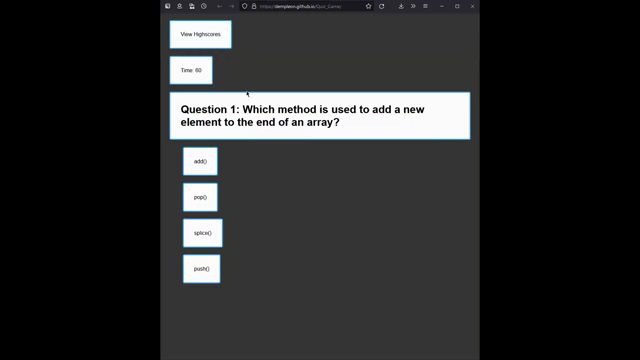

# Quiz Game
A quiz game to test the knowledge of a web developer. Anyone can try the quiz and their score is stored locally.

## Project Description
This application is an online quiz. There are 7 sets of questions with multiple choice answers. The user has 60 seconds to answer all questions. When the user clicks on the answer, the question changes and the user is notified if they got it wrong or right. When the user gets a question wrong, 10 seconds is subtracted from the quiz time. The resulting time left when all questions have been answered is the score of the user. The user is then able to store their score along with their name or initials. All scores are stored locally.

 

## Deployment
This webpage is deployed through github pages:
https://dempleon.github.io/Quiz_Game/

## Dev Notes
In order to save their scores, users must answer all questions. Scores are stored as an array element [playerName, score]. All hiscores are then passed to JSON.stringify() to be stored by the browser. The webpage dynamically creates hiscore table entries from the locally stored scores. The application only contains a single html document. All elements are dynamically hidden or shown.
